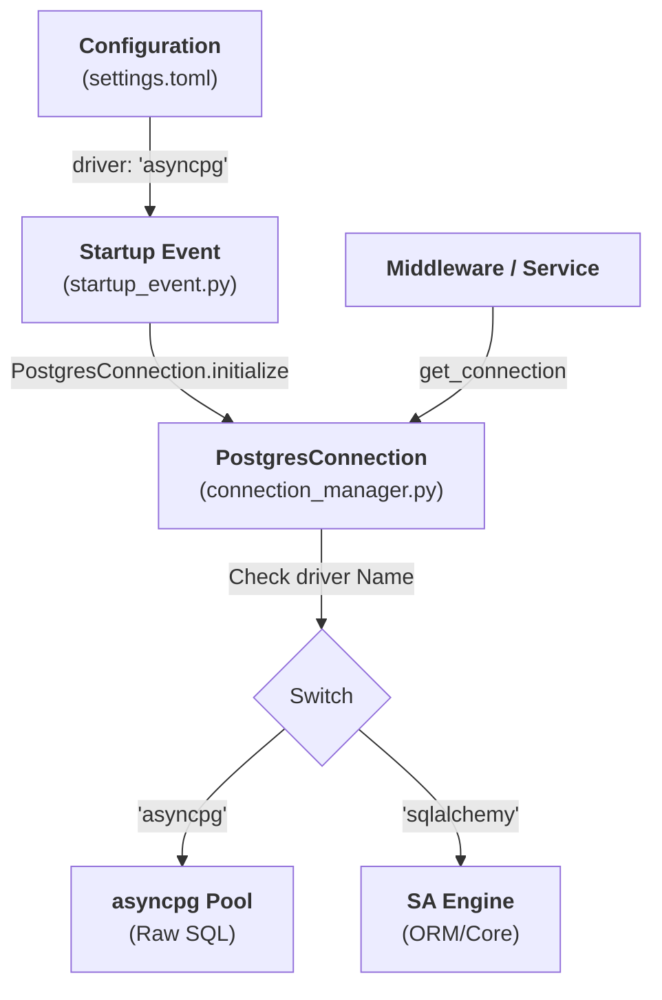

# 🏗️ Database System Specification: Core Infrastructure

This document serves as the **Technical blueprint** for rebuilding the database infrastructure from scratch and the **Reference manual** for system developers.

---

## 1. Architectural Blueprint (AI-Ready)
To reconstruct this system, an AI model must implement these five core pillars:

### A. The Engine Hub (`engines/`)
*   **Postgres Native ([asyncpg](file:///Users/abhisheksingh/Documents/Development/stack-foundations/backend/fastapi_core_base/src/shared/db/core/connection_manager.py#45-63))**: Primary engine for low-latency CRUD and binary protocols.
*   **ORM Layer (`SQLAlchemy`)**: Asynchronous engine for structured schema management and complex query building.
*   **Analytical Bridge (**ADBC**)**: Direct Arrow-to-Polars connectivity to bypass Python object overhead.

### B. Intelligent Connection Manager ([PostgresConnection](file:///Users/abhisheksingh/Documents/Development/stack-foundations/backend/fastapi_core_base/src/shared/db/core/connection_manager.py#12-167))
*   **Dual-Pooling Strategy**: Separate managed pools for [asyncpg](file:///Users/abhisheksingh/Documents/Development/stack-foundations/backend/fastapi_core_base/src/shared/db/core/connection_manager.py#45-63) (Native) and `SQLAlchemy` (ORM).
*   **Safety Guards**: `pool_pre_ping=True` for engine resilience and automated connection pruning (300s TTL).
*   **Transaction Wrappers**: Automated `commit`/`rollback` logic baked into the context managers.

### C. The Four-Lane execution API ([DatabaseService](file:///Users/abhisheksingh/Documents/Development/stack-foundations/backend/fastapi_core_base/src/shared/services/database_service.py#94-215))
1.  **Transactional**: CRUD operations returning standard Python lists.
2.  **Analytical**: Mass exports returning Polars DataFrames via ADBC.
3.  **Batch**: High-speed SQL batching (1k-10k rows) via `executemany`.
4.  **Bulk**: Ultra-fast binary ingestion (100k+ rows) via Postgres **COPY**.

### D. Adaptive Execution Engine (`AsyncQueryExecutor`)
*   **Heuristic Detection**: Automatically detects [read](file:///Users/abhisheksingh/Documents/Development/stack-foundations/backend/fastapi_core_base/tests/shared/db/test_query_analyzer_unit.py#51-53) vs [write](file:///Users/abhisheksingh/Documents/Development/stack-foundations/backend/fastapi_core_base/tests/shared/db/test_query_analyzer_unit.py#38-40) operations.
*   **Memory Intelligence**: Uses [psutil](file:///Users/abhisheksingh/Documents/Development/stack-foundations/backend/fastapi_core_base/tests/shared/db/test_query_analyzer_unit.py#143-148) to sense system RAM; automatically switches to [stream](file:///Users/abhisheksingh/Documents/Development/stack-foundations/backend/fastapi_core_base/src/shared/db/execution_lanes/transactional.py#78-108) mode if RAM < 0.5GB.
*   **Life-Cycle Decorator**: `@handle_streaming_lifetime` keeps sessions alive for asynchronous generators.

### E. Operational Monitoring & Safeties
*   **Pool Health Status**: Real-time reporting of active vs idle connections.
*   **Automated Timeouts**: Dynamic session-level [statement_timeout](file:///Users/abhisheksingh/Documents/Development/stack-foundations/backend/fastapi_core_base/tests/shared/db/test_transactional_unit.py#45-63) (30s Read/10m Write) and `lock_timeout` (10s).
*   **Contextual Driving**: Thread-safe driver switching using `ContextVars`.
*   **Zero-Block Watchdog**: Background execution of `EXPLAIN ANALYZE` for tracking slow queries into `base_pricing.bp_audit_slow_queries`.

---

## 2. Feature Mastery Inventory (Visual Summary)

1. **🔀 Multi-Driver Engine Hub**
*   **Native Postgres (asyncpg)**: Used for raw speed and direct binary protocol access.
*   **ORM Ready (SQLAlchemy)**: Provides structured data modelling and relationship management.
*   **Cloud Analytics (BigQuery)**: Integrated client for Google Cloud BigQuery operations.
*   **Extreme Exports (ADBC)**: Uses Arrow Database Connectivity for pulling millions of rows at C-speed directly into Polars.

2. **🛣️ The "Four Lane" Execution API**
*   **Transactional Lane**: Standard API/CRUD work returning Python `list[dict]`.
*   **Analytical Lane**: High-performance reads returning Polars `DataFrames`.
*   **Batch Lane**: High-speed SQL batching (1k–10k rows) using `executemany`.
*   **Bulk Lane**: Ultra-fast binary ingestion (100k+ rows) via the native **POSTGRES COPY** protocol.

3. **🌊 Connection Pooling & Hygiene**
*   **Dual-Driver Pooling**: Independent pools for [asyncpg](file:///Users/abhisheksingh/Documents/Development/stack-foundations/backend/fastapi_core_base/src/shared/db/core/connection_manager.py#45-63) (min 5, max 20) and `SQLAlchemy` (10 + 5 overflow).
*   **Pre-Flight Health**: `pool_pre_ping=True` ensures dropped connections are detected before they reach the application.
*   **Elastic Lifecycle**: Automated pruning of connections older than 300s to save database memory.
*   **Clean Exit**: `asyncio.gather` driven parallel shutdown of all pools during app termination.

4. **⏳ Professional Session Management**
*   **The Streaming Guard**: `@handle_streaming_lifetime` decorator ensures the DB connection stays open for the entire duration of an `async for` generator.
*   **Lifecycle Isolation**: [_stream_with_context](file:///Users/abhisheksingh/Documents/Development/stack-foundations/backend/fastapi_core_base/src/shared/db/execution_lanes/transactional.py#166-173) provides an isolated session scope that self-destructs only after data is fully consumed.
*   **Atomic Transactions**: Automatic transaction wrapping with `commit`/`rollback` logic baked into the connection manager.

5. **🧠 System Intelligence & Safety**
*   **Memory-Adaptive Strategy**: Automatically switches between [fetch_all](file:///Users/abhisheksingh/Documents/Development/stack-foundations/backend/fastapi_core_base/src/shared/db/execution_lanes/transactional.py#46-77), [batch](file:///Users/abhisheksingh/Documents/Development/stack-foundations/backend/fastapi_core_base/src/shared/db/execution_lanes/transactional.py#109-129), and [stream](file:///Users/abhisheksingh/Documents/Development/stack-foundations/backend/fastapi_core_base/src/shared/db/execution_lanes/transactional.py#78-108) based on available system RAM (via [psutil](file:///Users/abhisheksingh/Documents/Development/stack-foundations/backend/fastapi_core_base/tests/shared/db/test_query_analyzer_unit.py#143-148)).
*   **Auto-Timeout Guard**: Dynamically sets [statement_timeout](file:///Users/abhisheksingh/Documents/Development/stack-foundations/backend/fastapi_core_base/tests/shared/db/test_transactional_unit.py#45-63) (30s Read / 10m Write) and `lock_timeout` (10s) per query.
*   **Query Classifier**: Regex-based heuristic to detect if a query is a "Read" or "Write" to apply safety settings.
*   **Param Translation**: Automatic runtime translation of standard `:named_params` to native Postgres `$1` syntax.
*   **Zero-Block Watchdog**: Asynchronously monitors query execution time. 
    * If execution exceeds thresholds (e.g. `2.0s`), spins up a background thread to log an `EXPLAIN` plan into `base_pricing.bp_audit_slow_queries`. 
    * Employs memory debouncing to prevent spamming logs (once per query per day).
    * Enforces strict safety execution: Runs `EXPLAIN (ANALYZE, BUFFERS)` for reads, and only standard `EXPLAIN` for writes to prevent accidental data modification.
    * Monitors both native executor paths (transactional/bulk) and C++ ADBC paths (analytical).

6. **🛠️ Productivity & Architecture**
*   **Contextual Driving**: Uses `ContextVars` to switch drivers globally across a request without passing state objects.
*   **ORM Mixins**: `TimestampMixin` for automated `created_at`/`updated_at` column management.
*   **Global Constants**: Centralized `constants.py` mapping all Schemas, Tables, Materialized Views, and Stored Procedures for type-safe SQL construction.

---

## 3. Developer Quick-Start Guide

### A. Configuration
Ensure your `.env` or [settings.toml](file:///Users/abhisheksingh/Documents/Development/stack-foundations/backend/fastapi_core_base/toml_config/settings.toml) contains:
```toml
DB_USER = "user"
DB_PASSWORD = "password"
DB_HOST = "localhost"
DB_PORT = 5432
DB_NAME = "database"
```

### B. Standard Query (Lane 1)
```python
from src.shared.services.database_service import database_service

# Automatically selects the best strategy (fetch_all, batch, or stream)
results = await database_service.execute_transactional_query(
    "SELECT * FROM users WHERE status = :status",
    params={"status": "active"}
)
```

### C. Large Data Analysis (Lane 2)
```python
# Fetches 1M+ rows at C-speed into a Polars DataFrame
df = await database_service.execute_analytical_query("SELECT * FROM history")
```

### D. High-Speed Ingestion (Lanes 3 & 4)
```python
# Batch (1k-10k rows)
await database_service.execute_batch_query(insert_sql, data_list)

# Bulk (100k+ rows)
await database_service.execute_bulk_query("table_name", ["col1", "col2"], huge_data_list)
```

### E. Health Monitoring
```python
health = await database_service.get_pool_status()
print(health["asyncpg"]["active"]) # True
```

---

---

## 5. Database Lifecycle & Driver Management

The system follows a strict "Set once, Override when needed" approach.

### A. Driver Flow & Initialization

The system uses an **"Anchor vs. Isolated"** pattern to balance performance and safety.

1.  **Global Foundation (The Anchor)**:
    *   **Location**: [startup_event.py](file:///Users/abhisheksingh/Documents/Development/stack-foundations/backend/fastapi_core_base/src/app/extensions/startup_event.py)
    *   **Action**: `PostgresConnection.initialize(driver)` is called **exactly once** during the app startup event.
    *   **Result**: It prepares the shared connection strings and sets the global `cls.database_driver` state. This "primes" the factory.
2.  **Request Isolation (The Shield)**:
    *   **Location**: [database.py](file:///Users/abhisheksingh/Documents/Development/stack-foundations/backend/fastapi_core_base/src/shared/middleware/database.py) middleware
    *   **Action**: `DatabaseDriverManager.set_db_driver(driver)` sets a `ContextVar`.
    *   **Result**: This flags the driver choice for only that specific request. It **does not** call [initialize()](file:///Users/abhisheksingh/Documents/Development/stack-foundations/backend/fastapi_core_base/src/shared/db/core/connection_manager.py#40-44), preventing global state pollution and redundant parsing.
3.  **Tiered Resolution**:
    *   [get_connection()](file:///Users/abhisheksingh/Documents/Development/stack-foundations/backend/fastapi_core_base/src/shared/db/core/connection_manager.py#84-120) resolves the active driver in this priority:
        1.  `ContextVar` (Request-specific override from Middleware)
        2.  `cls.database_driver` (Global foundation from Startup Event)
        3.  Fallback to `"asyncpg"`

### B. Startup Event vs Middleware

| Feature | Startup Event ([startup_event.py](file:///Users/abhisheksingh/Documents/Development/stack-foundations/backend/fastapi_core_base/src/app/extensions/startup_event.py)) | Middleware ([database.py](file:///Users/abhisheksingh/Documents/Development/stack-foundations/backend/fastapi_core_base/src/shared/middleware/database.py)) |
| :--- | :--- | :--- |
| **Frequency** | Once (at start) | Every Request |
| **Logic** | `PostgresConnection.initialize()` | `DatabaseDriverManager.set_db_driver()` |
| **Focus** | **Global Foundation**: Pools & Strings | **Request Scope**: Isolation & Leasing |
| **Safety** | Sets foundation for all workers | Shields requests from each other |
| **Teardown** | Shuts down clusters on app exit | Guarantees release via `async with` |

### C. Execution Diagram



---

## 6. Testing Connection Strategy

The testing suite ensures total control over connections via specialized fixtures.

### A. Summary of Differences

| Feature | App Startup | Pytest Integration | Pytest Unit |
| :--- | :--- | :--- | :--- |
| **Initializer** | [startup_event.py](file:///Users/abhisheksingh/Documents/Development/stack-foundations/backend/fastapi_core_base/src/app/extensions/startup_event.py) | [real_db_service](file:///Users/abhisheksingh/Documents/Development/stack-foundations/backend/fastapi_core_base/tests/conftest.py#91-104) fixture | None (Mocked) |
| **Logic** | [initialize()](file:///Users/abhisheksingh/Documents/Development/stack-foundations/backend/fastapi_core_base/src/shared/db/core/connection_manager.py#40-44) once | [initialize()](file:///Users/abhisheksingh/Documents/Development/stack-foundations/backend/fastapi_core_base/src/shared/db/core/connection_manager.py#40-44) per fixture | No initialization |
| **Driver** | From [settings.toml](file:///Users/abhisheksingh/Documents/Development/stack-foundations/backend/fastapi_core_base/toml_config/settings.toml) | Forced to [asyncpg](file:///Users/abhisheksingh/Documents/Development/stack-foundations/backend/fastapi_core_base/src/shared/db/core/connection_manager.py#45-63) | None / Mocked |
| **Network** | Real | Real | **Zero** |

### B. Integration Tests (Real Access)
Fixtures like [real_db_service](file:///Users/abhisheksingh/Documents/Development/stack-foundations/backend/fastapi_core_base/tests/conftest.py#91-104) recreate the foundation for every test:
1.  **Initialize**: Inside the fixture, `PostgresConnection.initialize(driver="asyncpg")` builds the URLs.
2.  **Teardown**: The fixture calls `await PostgresConnection.close()` to destroy the pool immediately, preventing connection leakage in large test suites.

### C. Unit Tests (Isolated)
Fixtures like [db_service](file:///Users/abhisheksingh/Documents/Development/stack-foundations/backend/fastapi_core_base/tests/conftest.py#78-89) or [api_client](file:///Users/abhisheksingh/Documents/Development/stack-foundations/backend/fastapi_core_base/tests/conftest.py#150-184) **never** call [initialize()](file:///Users/abhisheksingh/Documents/Development/stack-foundations/backend/fastapi_core_base/src/shared/db/core/connection_manager.py#40-44). They use `unittest.mock` to intercept all database calls, making them instant and safe with zero hardware dependencies.
